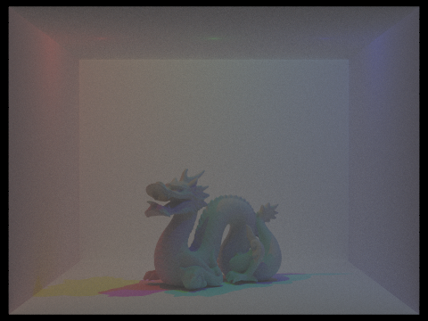

# Fog

By Meiqi Sun, Akhil Vemuri, Connor Dang, and Samuel Berkun 

## Abstract
Through this project, we built a volumetric ray tracer that renders the effect of fog onto the scene. The raytracer that we started with had the assumption that the rays would travel in straight line until it hits the surface of an object. However, when mediums are present, we need to break the assumption: when hitting a fog particle, the ray will also be affected (absorption, scattering, etc). This project supports both homogeneous and bounded-volume heterogeneous fog rendering by applying the techniques of ray-marching, anisotropic scattering, fog shadowing, and mesh-bounded scattering.

## Technical Approach

### Starting Point

We started from the raytracer in CS184's Project 3-1. We then integrated parts of Project 3-2 into it, such as the mirror and glass materials, to get a combined project 3 as our starting point.

The existing raytracer had capabilities to render area and point lights, and several types of materials. It could also render dae files created with Blender, although it did not have the capability to deal with several features present in typical Blender projects (i.e. non-triangular meshes, image textures, spotlights, principled BSDFs). 

### Dae File Generation and new Features

Since we wanted to showcase the abilities of our volumetric renderer, we spent a significant amount of time learning Blender, creating dae files, and implementing new features. 

We first added spotlights to the raytracer implementation, and ran into a significant number of technical challenges while doing so (see [challenges](#challenges)).

When it came time to add volume-bounded fog, we also added a custom BSDF type, a parser for it in `collada.cpp`, and a BSDF implementation in `bsdf.cpp`.


### Initial Implementation

There are a few different ways one could approach rendering volumetric effects like smoke or fog. The most naive way would be to simply scatter billions of tiny sphere meshes throughout the scene, accurately simulating the billions of particles that make up fog or smoke. However, this is a bit inefficient, especially since most computers don't even have the memory required to store all of those sphere meshes.

Instead of capturing billions of ray-sphere intersections, we use a statistical approach operating under the assumptions that the particles are very small, uniformly distributed in space, and that the distance between particles is much larger than the particles itself. By doing this, we can effectively approximate the light-particle interaction for a given media with some notion of an average interaction. Initially, we tried 2 approaches to accomplish this goal.

In our first approach, or the ray marching implementation, we begin by computing an intersection using the BVH. Next, we iteratively traverse the ray starting from the camera in $$t=0.1$$ increments. With $$p=0.015$$, we encounter a fog particle which we use as the basis of our intersection for the rest of the raytracing algorithm. If no particle is encountered, this means the ray intersects the scene. By varying the value $$p$$, we can control the density of the fog.

This implementation was slow and the high quality of the results depended on using small values of t to simulate a continuous distribution the particles. Additionally, we found that this implementation did not fit the structure of our existing path tracer well - would require lots of invasive changes to the overall raytracing pipeline to implement and make efficient. 

In our second approach, we used an analytical method that models the continuous distribution of fog particles via a exponential distribution. This allowed us to compute the potential fog intersection point without having to iterate along the ray path by simply sampling the inverse CDF of the exponential distribution ($$-\log(\epsilon)/ \lambda$$)- giving us better performance and numerical precision for our methods.

We modelled fog density as the exponential parameter $$\lambda$$ and found that values between $$0.1$$ to $$0.3$$ worked well. As in the first approach, we begin by casting a way into the scene to find $$t_i$$ (the time of intersection with the scene). Next, we sample from our exponential distribution to determine a value $$t_f$$ to use as the location of the intersected fog particle along our ray path. If $$t_f > t_i$$, then we compute the radiance from the fog particle and return it. Otherwise, our ray has intersected the scene before the fog particle in which we compute the radiance from the intersection point in the scene.

### Isotropic vs Anisotropic scattering

Several papers we read mentioned that realistic scattering was typically not isotropic, and gave the Henyey-Greenstein function as an easy-to-compute anisotropic distribution that could give more realistic results (see references 1, 2). The Henyey-Greenstein function is given by

 $$\frac{1}{4 \pi} \frac{1 - g ^ 2}{[1 + g ^ 2 - 2g\cos\theta]^\frac{3}{2}}$$ 
 
This provides a configurable phase function when modeling ray scattering after encountering a fog particle. 

We choose this function because it is very flexible and allows us to model different types of scattering. As we vary $$g$$,  we adjust the level of shearing we have for our pdf function. When $$g = 0$$, the function simplifies to $$\frac{1}{4 \pi}$$, which entails an uniform scattering across all directions. The higher the absolute value of $$g$$ is, the more "oval-ly" it spreads along the directions of scattering. And for positive $$g$$, we have more scattering along the opposite direction of the ray; while for negative $$g$$, we would have more scattering along the original direction of the ray. 

Here is a comparison between isotropic scattering, and anisotropic scattering using the Henyey-Greenstein function. The following scene uses three point lights of different colors, to show how the colors interact with the fog:


No fog | Isotropic scattering ($$g = 0$$)
-------- | --------
 | 

Back-biased scattering ($$g > 0$$) | Forward-biased scattering ($$g < 0$$)
-------- | --------
 | 


Both isotropic scattering and forward-biased scattering provide realistic-looking results. Forward-biased scattering tends to create more "glare" from lights pointed toward the camera, which may be desirable depending on the scene. In the above scene, it aids in creating a natural-looking haze around the point lights.

### Improving the performance of Anisotropic Scattering

Our initial implementation of anisotropic scattering used the Henyey-Greenstein function to calculate the reflectance of the fog, but sampled the reflectance direction using a uniform spherical distribution. This created noise at high anisotropy levels (such as $$g = 0.9$$). This solution was to importance sample the Henyey-Greenstein function. Reference 3 describes an analytical solution, as well as several methods that can be used if an analytical solution was not available. We ended up using this equation from reference 3:

$$z = \frac{1}{2g} (1 + g^2 - (\frac{1 - g^2}{1 - g + 2g\epsilon_1})^2)$$

Which generates a correctly-distributed $$z$$-value for the Henyey-Greenstein scattering distribution.

Here are some sample renders with $$g = -0.6$$, and at 256 samples to show the reduced noise:

Uniform sampling | Importance sampling
-------- | --------
 | 

### Fog Shadowing

Note that in the rendering pipeline, direct lighting functions assume that a surface may be directly lit unless it is eclipsed by an object. This assumption still holds mostly true - however, a surface may now be eclipsed by either an object _or fog_.

To simulate an object being eclipsed by fog, our initial approach was to do a statistical test for fog when tracing a direct lighting ray, similar to the below psuedocode:
```cpp
double fog_dist = random_fog_location(ray);
if (!bvh->intersect(ray, isect) && fog_dist > dist_to_light) {
    ...
    L_out += lighting;
}
```
However, this created renders that were slightly grainier than the original pathtracer. To make it converge faster, we analytically solved for the probability that a given ray would be eclipsed by fog. Specifically, fog with density $$\lambda$$ has an exponential distribution, with CDF $$1 - e^{-\lambda t}$$, so if the light is some distance $$t$$ away, the CDF gives the probability that it will hit fog. The updated implementation has the following psuedocode:
```cpp
if (!bvh->intersect(ray, isect)) {
    ...
    L_out += prob_no_fog * lighting;
}
```

Here is what a typical render will look like without and with fog shadowing:

No fog shadowing | Fog shadowing
-------- | --------
 | 

The difference is mainly a decrease in overall brightness; it's most apparent in surfaces further from the light, such as the floor.

### Mesh-bounded Scattering

With our fog implementation complete, we decided to go a step further and attempt mesh-bounded scattering. For mesh-bounded scattering, the fog is enclosed in a mesh and light rays intersecting with the mesh are no longer bounced off of the surface of the volume and instead may pass completely through, intersect with another object inside, or interact with a fog particle.

In our design, we make the fog density a property of the ray - making the appropriate changes in our fog tracing pipeline to inherit the fog density from the ray we are working with. This allows us to vary the fog density throughout various sections of space since each intersection/bounce is a separate ray.

To implement this, we took inspiration from the glass/mirror materials previous implemented in the initial codebase. With these materials, the BRDF functions return a 'mirrored' ray direction to sample the radiance at a different location in the scene. To model our fog property, we created a Fog BRDF which deterministically selects the bounce direction to be the continuation of the previous ray. This allows us to sample the radiance within the bounded volume as well as on the other side of the volume.

When a ray initially intersects the fog volume, a second ray is cast (in the same direction) into volume bounded by the mesh. This ray's fog density property is incremented by the fog density of the mesh's Fog BRDF. If the ray eventually intersects the fog volume boundary again (to exit), the ray's fog density property is decremented. This allows us to revert to the initial fog density that we had before entering the fog volume. The global illumination function was updated such that newly created rays (to simulate bounces in the light path) are initialized with the same fog density as its parent ray and are incremented/decremented by the concentration of fog represented by the boundaries they touch.

Ultimately, these changes come together to create some pretty neat effects as shown in the renders below. Some features to take note of are the semi-transparent nature of the scene objects and the visibility of objects when directly illuminated vs. indirectly illuminated.

$$\lambda = 0.3$$ Fog Density | $$\lambda = 10$$ Fog Density | Solid Dragon
-------- | -------- | --------
 |  | 

$$\lambda = 10$$ Fog Density w/ Different Light Angle | Red Fog Dragon
-------- | -------
 | 

One limitation we ran into with our method include an inability to render the shadows nicely. With less concentrated fog volumes, the blocked light should decrease and we should have softer shadows beneath the volumes. In our implementation, this does not happen because of the way light is sampled at points in the scene. Because the renderer is built upon the assumption that all objects are solid, it does not consider that light may pass through objects which is something that should occur with our fog volume.

Another limitation with our approach is that mesh-bounded scattering can only be rendered with global illumination. Similar to glass and mirror materials, light requires multiple bounces before it can reach the fog particles within the bounded volume.


## Challenges
- Problem: Dae File Spotlight Rendering
    - Since we were working on volumetric rendering, we wanted to add multiple spotlights to the scene so that we can better visualize our results. However, throughout the process, we met multiple challenges. 
        1. First of all, the most recent version of Blender had a different format for the exported dae file, and our initial codebase is unable to render the image. Thus, we tried to install and use Blender 2.7 instead (we also later tried to update `collada.cpp` to enhance the parsing capability). 
        2. Rendering on local machines took a very long time, and would frequently give completely black images (possibly due to the specific OS requirements of some modules used in dae file parsing). We initially thought it was a dae file issue, and spent very long time trying to compare and debug the dae file. But it turns out that if we run on the hive machine, the images soon rendered properly.
        3. We tried to move camera positions and angles when creating the dae files, and soon realized that we should instead stick to the default. Otherwise, our rendered image would be targeted at a very wrong direction.
        4. When we added spotlights to the scene, it was initially not recognized by our code. We again thought it was because we had the wrong spotlight settings from Blender (actually most of the light source types work, but only this spotlight isn't showing up properly). We later realized that it was because we had an empty spotlight implementation in `light.cpp`, and that after completing the function and returning the correct radiance, we were able to observe spotlights in our results.


- Problem: Noisy Rendering
    - With our original implementation, the images looked quite noisy: there were many black,  unlit pixels in the scene, and even we sample rates past a certain amount, the results look exactly the same (exact same number of black pixels) even after we increase the sample rate. 
    - We resolved the issue by comparing the sampling rate plot and the rendered image to notice that the black pixels correspond exactly to the parts with little samples (blue on the rate graph). We therefore inferred that the algorithm is tricked into thinking that the pixel value has converged when it just got some black pixels due to chance. We realized that this is because when we get closer to the light source, there's less illuminated pixels relative to the unlit pixels which makes it increasing likely to sample unlit pixels and more likely to get a lot of dark pixels in a row. Hence, the algorithm then "believes" that the value has converged so won't keep sampling the pixel anymore. Figuring out the cause of the issue, we increased the batch size of adaptive sampling, and the scene looked much better. 


- Lessons We Learnt
1. Check the compatibility of the codebase w/ different types of lights before rendering
    It might be a parser issue/implementation issue/light power issue, etc. We should think thoroughly about the possible causes of the issues while debugging. 
2. Pay attention to adaptive sampling
    The way and quality we run sampling would have a great effect on the quality of our final output image, so we need to be sure that our algorithm stops sampling only after it truly converged (and not actually be tricked)
3. Understand the papers and extract (simplify to) the essential parts to build the model for our implementation
    Models in the papers are probably very complicated and computationally expensive, so extracting the essential "big ideas" is crucial 

## Results

Our renderer is particularly good at emphasizing light beams from spotlights:

No fog direct lighting | Fog direct lighting | Fog global illumination
-------- | -------- | --------
 |  | 
-------- | -------- | --------
 |  | 

Here is a dragon model front-lit by a spotlight. Note the shadow rays behind the dragon:

Fog direct lighting | Fog global illumination
-------- | --------
 | 

Some other scenes we created:

Car with headlights | Gems
-------- | --------
 | 

Our crowning achievement is re-creating Disney's render of a dragon lit by colored lights:

Ours | Disney's
-------- | --------
 | 

(Our render isn't exactly the same, but in our defense, our budget isn't either)

Finally, we had some fun creating ghosts:

Fog dragon | Solid dragon
-------- | --------
 | 


## References

1. Light Transport in Participating Media: [https://cs.dartmouth.edu/~wjarosz/publications/dissertation/chapter4.pdf](https://cs.dartmouth.edu/~wjarosz/publications/dissertation/chapter4.pdf)
2. Rendering Participating Media with Bidirectional Path Tracing: [http://luthuli.cs.uiuc.edu/~daf/courses/rendering/papers/lafortune96rendering.pdf](http://luthuli.cs.uiuc.edu/~daf/courses/rendering/papers/lafortune96rendering.pdf)
3. On Sampling Of Scattering Phase Functions: [https://arxiv.org/pdf/1812.00799.pdf](https://arxiv.org/pdf/1812.00799.pdf)
4. Volumetric Path Tracing: [https://justgood.dev/docs/740-paper.pdf](https://justgood.dev/docs/740-paper.pdf)


## Contributions from each team member

 - Everyone:
    - General approach and bug fixing
 - Meiqi Sun:
    - Math
    - Dae file generation
    - Spotlight implementation
 - Akhil Vemuri
    - Dae file generation
    - Spotlight dae file generation
 - Connor Dang
    - ray marching implementation
    - mesh-bounded volume implementation
 - Samuel Berkun
    - spotlight implementation
    - scattering implementation
    - anisotropic scattering
